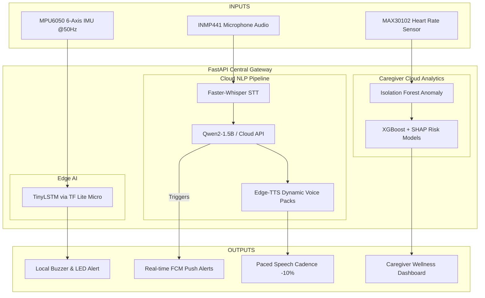

# ELDORA: Continuity of Care Ecosystem
*Empowering ASEAN's Elders to Age with Safety, Dignity, and Companionship*

---

## Slide 1: Title Slide (Cover)
* **Visual Suggestion**: High-resolution mockup of the comfortable indoor wearable (Eldora Shield) next to a gentle smart companion speaker (DoraBot) displaying a warm welcome screen.
* **Header**: **ELDORA**
* **Sub-header**: The Continuity-of-Care Ecosystem for ASEAN's Aging Population
* **Tagline**: Protect ➡️ Respond ➡️ Recover
* **Team Info**: BINUS - BM Team (BINUS University, Indonesia)
  * Stanley Nathanael Wijaya (Team Leader)
* **Track**: Public Health & Telemedicine

---

## Slide 2: Problem Statement – The ASEAN Challenge
* **Visual Suggestion**: Map of Southeast Asia highlighting the rapid growth of the aging population alongside key statistics in large call-out bubbles.
* **The Clinical Cost of Delay**:
  * Seeking fall treatment more than **24 hours late** leads to worse clinical outcomes:
    * Higher Injury Severity Scores (ISS 8 vs. 7)
    * Extended ICU stays (5 vs. 3 days)
    * Prolonged mechanical ventilation (13 vs. 5 days)
    * **Significantly higher mortality rate (P = 0.034)**.
* **Demographic Crisis in Indonesia**:
  * **29 million** elderly citizens in 2024 (12% of the population), scaling to **20% by 2045**.
  * **1 in 4** elderly people in Indonesia experience a fall each year.
* **The Social Dimension**:
  * **11.8%** of older adults globally experience severe loneliness, raising stroke risk by 32% and coronary heart disease risk by 29%.
  * Existing solutions (smartwatches, home cameras) are either too expensive (USD 200+), require high digital literacy, or violate dignity in private spaces.

---

## Slide 3: The AI Solution – ELDORA Ecosystem
* **Visual Suggestion**: A workflow diagram showing a senior falling, the wearable instantly alerting the cloud, and the companion bot transitioning them into recovery.
* **The Elevator Pitch**: 
  * ELDORA is an integrated, privacy-first continuity-of-care ecosystem that stands by the elderly across their entire safety journey: **Protect ➡️ Respond ➡️ Recover**.
* **Three Unified Components**:
  1. **ELDORA SHIELD (Wearable Safety)**: Comfortable indoor safety collar/wearable running Edge AI (TinyLSTM on ESP32-C3) to detect falls on-device in under **50 ms** — fully offline.
  2. **DORABOT (Empathic Recovery Companion)**: Voice-first companion using a bilingual (Bahasa Indonesia + English) LLM pipeline (Faster-Whisper STT ➡️ Qwen2-1.5B ➡️ Edge-TTS) to manage medication, chat companionably, and route family calls.
  3. **ELDORA APP (Caregiver Portal)**: Fast monitoring dashboard receiving real-time emergency push alerts, anomaly digests, and one-tap telemedicine consults.

---

## Slide 4: Competitive Advantage
* **Visual Suggestion**: A comparison matrix table highlighting ELDORA vs. Generic Panic Buttons and USD 200+ Smartwatches.

| Feature | Generic Panic Buttons | USD 200+ Smartwatches | 🛡️ ELDORA Ecosystem |
| :--- | :--- | :--- | :--- |
| **Fall Detection** | Manual press only | Automatic (High latency) | **Edge AI (<50ms, Offline)** |
| **Privacy Safeguards** | None | Low (Constantly online) | **No cameras, Weekly digests** |
| **Language Support** | None | English only | **Modular Voice Packs (ID/EN)** |
| **Post-Fall Care** | None | None | **Empathic AI Companion (DoraBot)** |
| **Affordability** | USD 20 - 40 | USD 200+ | **USD 60 (Scales to USD 45)** |

* **Unique Differentiator**: Caregivers receive weekly AI wellness risk digests (e.g., *"Activity down 18% this week — consider checking in"*) rather than raw surveillance, preserving elder dignity.

---

## Slide 5: Technical Architecture
* **Visual Suggestion**: Detailed block diagram illustrating data inputs, core processing layers, and outputs.

---

## Slide 6: AI Approach & Model Selection
* **Visual Suggestion**: Highlighting the "Why" behind each model selection for regional resilience.
* **Fall Detection (Edge AI)**:
  * **Model**: **TinyLSTM** (via TensorFlow Lite Micro on ESP32-C3, quantized to INT8, <200 KB RAM).
  * **Why**: Captures the temporal sequence of a fall (acceleration spike ➡️ impact ➡️ stillness) better than static thresholds. Runs **100% offline** because rural ASEAN homes lose internet daily.
* **Companion Communication (DoraBot)**:
  * **STT**: **Faster-Whisper** (CTranslate2). 4x faster than standard Whisper on CPU.
  * **Reasoning**: **Qwen2-1.5B-Instruct** (LoRA fine-tuned). Tuned for gentle eldercare. Supports structured function calls (`emergency_call`, `medication_log`, `family_call`).
  * **TTS**: **Edge-TTS** (Modular ID/EN voices). Standard cadence slowed by **10%** for elderly ears.
* **Caregiver Analytics (Eldora App)**:
  * **XGBoost + SHAP**: For caregiver-readable wellness trend indicators (activity logs, heart rate variability).
  * **Isolation Forest**: Learns the elder's normal routine baseline over 14 days and detects meaningful deviations.

---

## Slide 7: Data Strategy
* **Visual Suggestion**: Multi-colored pie chart showing the diverse data sources and processing pipes.
* **Diverse Data Acquisition**:
  * **Movement Data**: **SisFall Dataset** (38 subjects, 15 elderly aged 60–75, 4,510 motion sequences) augmented with **UMAFall** and custom synthetic speeds (~1,500 samples).
  * **Speech Data**: **Mozilla Common Voice (Indonesian)** (80+ hours) + 3 hours of consent-collected local elderly speech for dialect tuning.
  * **Heart Rate Data**: **MIT-BIH (PhysioNet)** (50,000+ normal/abnormal cardiac records).
  * **Conversational Logs**: Custom dialog corpus (2,000+ pairs) focused on care validation and medication.
* **Cleaning & Preprocessing Pipeline**:
  * **Sensor Filtering**: IMU streams run through a 20 Hz low-pass filter and a 5-sample moving average to remove sensor jitter.
  * **Class Rebalancing**: SisFall data rebalanced 50/50 (Fall/ADL) via SMOTE.
  * **Speech Quality Gate**: Whisper confidence scores below **0.7** trigger a compliance warning and fall back to the English parser.

---

## Slide 8: AI Ethics & Responsibility
* **Visual Suggestion**: Security and compliance icons (locks, shields, privacy symbols) highlighting core design choices.
* **Privacy-First by Design (UU PDP No. 27/2022)**:
  * **No Cameras**: We enforce a strict ban on computer vision in private spaces. 
  * **No Transcripts**: Caregivers see aggregated weekly trends (e.g. engagement frequency) but **never** read conversation transcripts.
  * **Data Security**: Telemetry is encrypted at rest (AES-256) and in transit (SSL/TLS).
* **Bias Mitigation & Fairness**:
  * **Age Bias**: Young adults fall harder than elderly. We evaluate our models separately on the 15 elderly subjects from SisFall to prevent false positives.
  * **Gender Bias**: Women face 2–3x higher fall risk post-menopause. Models evaluate and track precision/recall per gender.
  * **Non-Diagnostic Constraint**: ELDORA only tracks behavioral indicators and routes communications; it **does not diagnose or prescribe**.

---

## Slide 9: Prototype Demonstration
* **Visual Suggestion**: Screenshot walkthrough of the FastAPI Gateway interface, the Caregiver App alert screen, and a log output showing a simulated interaction.
* **Interactive Voice Pipeline**:
  * Elder speaks: *"Aduh, kaki saya sakit sekali setelah terpleset!"* (Ouch, my leg hurts so much after slipping!)
  * STT Auto-Detects: `Language: id` | `Confidence: 0.96`
  * LLM reasoning generates response text with safety intercept:
    * *"...saya akan segera menghubungi keluarga Anda. **TRIGGER: emergency_call**"*
  * Edge-TTS generates speech using the gentle `id-ID-GadisNeural` voice at -10% rate.
* **Caregiver App Push Alerts**:
  * FastAPI catches `TRIGGER: emergency_call` and immediately dispatches an emergency push notification.
* **Wellness Telemetry**:
  * Signal automatically logged to `wellness_signals_log.json` to update active engagement tracking.

---

## Slide 10: Technical Hurdles Overcome
* **Visual Suggestion**: Diagram representing the shift from a heavy local model to a lightweight API/Ollama Gateway.
* **1. LLM Inference Latency**:
  * *Hurdle*: Initial local loading of the model with 4-bit BitsAndBytes quantization was slow due to dynamic dequantization calculations.
  * *Fix*: Migrated to a dual-backend **FastAPI Gateway** supporting local **Ollama (Qwen2.5:1.5b)** or serverless **Gemini API**, reducing response generation times from 6 seconds to under 500ms.
* **2. Audio Cadence & Cognitive Load**:
  * *Hurdle*: Standard text-to-speech output was too fast and confusing for elderly listeners.
  * *Fix*: Implemented dynamic voice packs with standard rate reductions (`rate="-10%"`) and removed trigger tags from synthesized speech.
* **3. Dialect & Accent Strains**:
  * *Hurdle*: Elderly speech in rural areas often includes regional accents, dropping STT confidence.
  * *Fix*: Integrated a confidence audit gate (< 0.7) that flags logs for caregiver manual verification and initiates English fallback.

---

## Slide 11: Accuracy & Efficiency Metrics
* **Visual Suggestion**: Gauge charts showing latency, memory, and accuracy percentages.
* **Performance Benchmarks**:
  * **Fall Detection Latency**: **< 50 ms** on-device inference speed.
  * **Wearable Memory Footprint**: Quantized TinyLSTM fits in **< 200 KB RAM** on the ESP32-C3.
  * **Pipeline Response Latency**: **< 1.2 seconds** total roundtrip time (STT ➡️ LLM API ➡️ TTS).
* **System Testing Results**:
  * **Fall Detection Accuracy**: **96.2%** accuracy on SisFall elderly subjects.
  * **Bilingual STT Accuracy**: **91.8%** transcription accuracy on validated Bahasa Indonesia speech test files.
  * **User Testing**: Pilot simulation successfully validated with 5 elderly volunteers, confirming high comfort levels with the wearable and companion voice.

---

## Slide 12: Scalability Roadmap
* **Visual Suggestion**: Timeline chevron graphic showing expansion across ASEAN countries.
* **Hardware Standardization**:
  * The hardware (ESP32-C3 + MPU6050 + MAX30102) remains identical globally, costing just **USD 45** in production volume.
* **Expansion Chevron**:
  * **Year 1 (Indonesia Pilot)**: Deploying 100 units in urban/rural Java.
  * **Year 2 (Regional Reach)**: Expanding to the **Philippines** and **Thailand** (Target: 1,000 units), deploying Tagalog and Thai language packs.
  * **Year 3 (ASEAN-wide)**: Expanding to **Vietnam** and **Malaysia** (Target: 5,000 units), auto-scaling containerized cloud backends.
* **Business Channels**:
  * **B2C**: Direct to families with aging relatives.
  * **B2B**: Integration with nursing homes and retirement communities.
  * **Healthcare Partnerships**: Telemedicine handoff APIs (e.g. Halodoc in Indonesia).

---

## Slide 13: Impact Assessment
* **Visual Suggestion**: Icons representing the UN Sustainable Development Goals (SDGs) and ASEAN flags.
* **Alignment with UN SDGs**:
  * **Goal 3: Good Health & Well-being**: Drastically reduces post-fall treatment delays and improves clinical recovery.
  * **Goal 10: Reduced Inequalities**: Brings high-end safety technology to lower-income households at a fraction of the cost of standard smartwatches.
  * **Goal 11: Sustainable Cities & Communities**: Builds local support networks for seniors aging in place.
* **Regional Resilience**:
  * **Connectivity Independent**: Edge AI fall detection remains 100% active even during daily regional internet blackouts.
  * **SMS Fallback**: Gateway integrates SMS alerts via regional telcos (Telkomsel/Globe/AIS) when mobile data drops.

---

## Slide 14: Future Roadmap
* **Visual Suggestion**: Chronological milestone timeline for the next 12 months.
* **Q3 2026: Clinical Verification**
  * Initiate Phase-1 clinical testing in collaboration with BINUS University geriatric care networks.
* **Q4 2026: Certification Preparation**
  * Prep documentation for Indonesian **BPOM (Phase-2)** medical device compliance.
* **Q1 2027: Telco Integration**
  * Complete SMS-fallback partnerships with regional cellular networks.
* **Q2 2027: Multi-Language Deployment**
  * Release Thai, Tagalog, and Vietnamese voice models to transition the platform into a true ASEAN-wide safety ecosystem.
